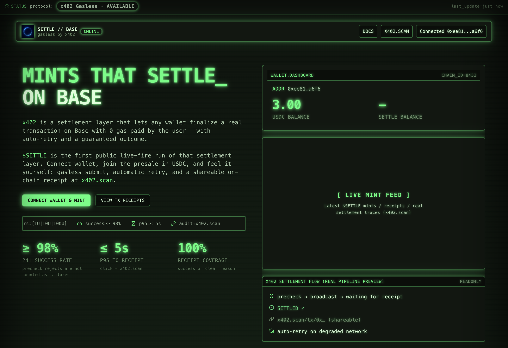

# Settle on Base — DApp Frontend

[](https://settleonbase.xyz)

> The official frontend for **Settle on Base (SOB)** —  
> a live minting dashboard built on **Base Mainnet**, using **EIP-3009** USDC→SOB transfer authorization.  
>  
> 🌐 **Live Site:** [https://settleonbase.xyz](https://settleonbase.xyz)

---

## Features

- **Multi-Wallet Connection**
  - Supports **MetaMask**, **Coinbase Wallet**, and **OKX Wallet**
  - Uses **EIP-6963 RDNS** to accurately detect injected providers
  - Emits rich custom events:  
    `wallet:connected`, `wallet:wrongNetwork`, `wallet:chainChanged`, `wallet:disconnected`

- **Network Awareness**
  - Respects each wallet’s *own* Base configuration
  - If the user is not on Base (chainId 8453), a **CRT-style green notice** guides manual network switch  
    → once switched, the modal automatically closes

- **Wallet Dashboard**
  - Shows **USDC** and **SOB** balances above `[ LIVE MINT FEED ]`
  - Updates in real time by subscribing to **new block headers (`eth_subscribe: newHeads`)**
  - Falls back to timed polling when subscriptions aren’t supported

- **Dark CRT-Themed UI**
  - TailwindCSS-based neon-green cyber theme
  - Unified design across wallet modal and mint dashboard

---

## Tech Stack

| Layer | Technology |
|-------|-------------|
| Framework | React 18 + TypeScript |
| Styling | TailwindCSS + CRT neon theme |
| Wallet API | EIP-1193 + EIP-6963 |
| On-chain Calls | `eth_call` via injected provider / Base public RPC fallback |
| Chain | **Base Mainnet (chainId 8453)** |

---

## Setup

### Clone the repository
```bash
git clone https://github.com/<yourname>/settle-on-base.git
cd settle-on-base
